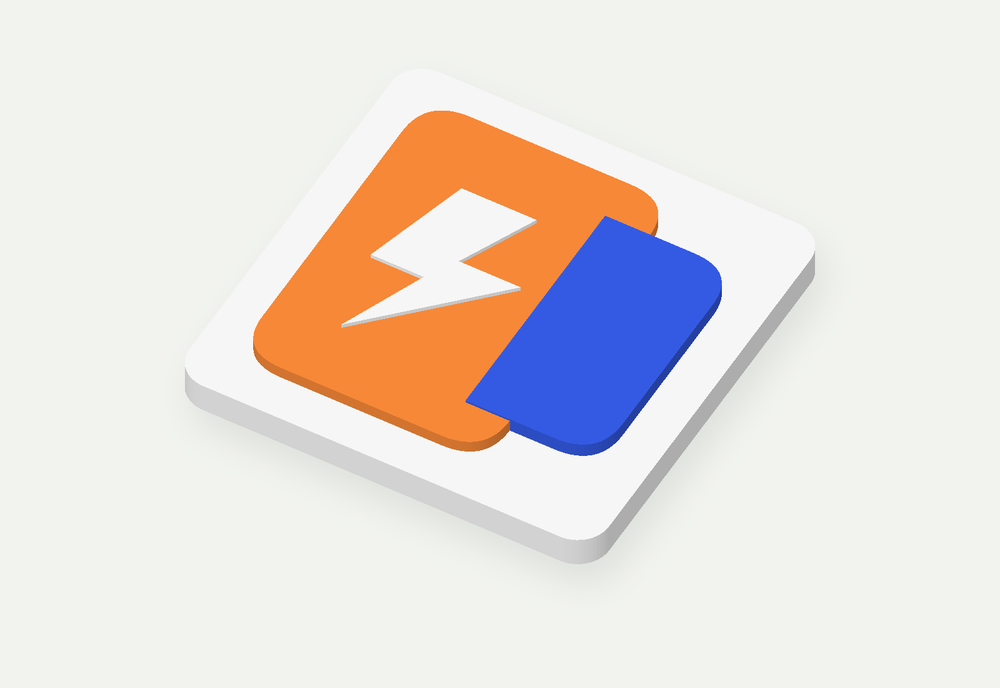
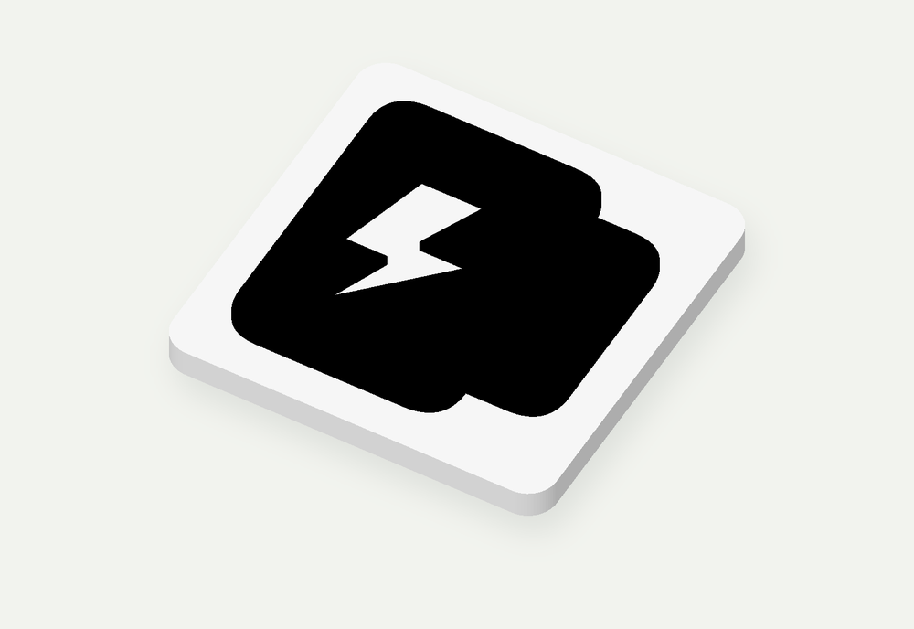
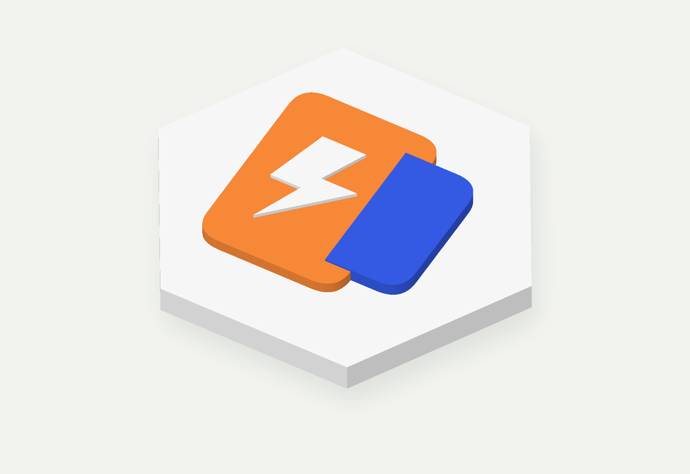
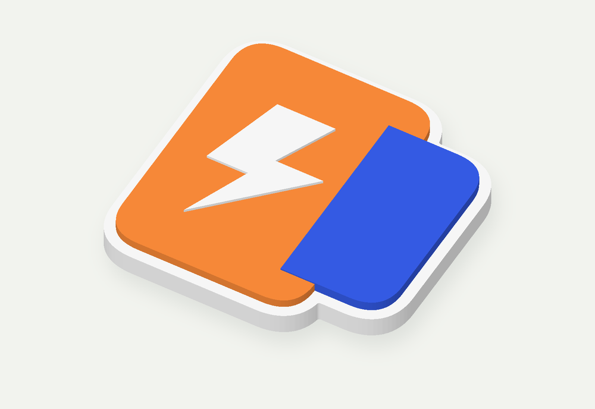
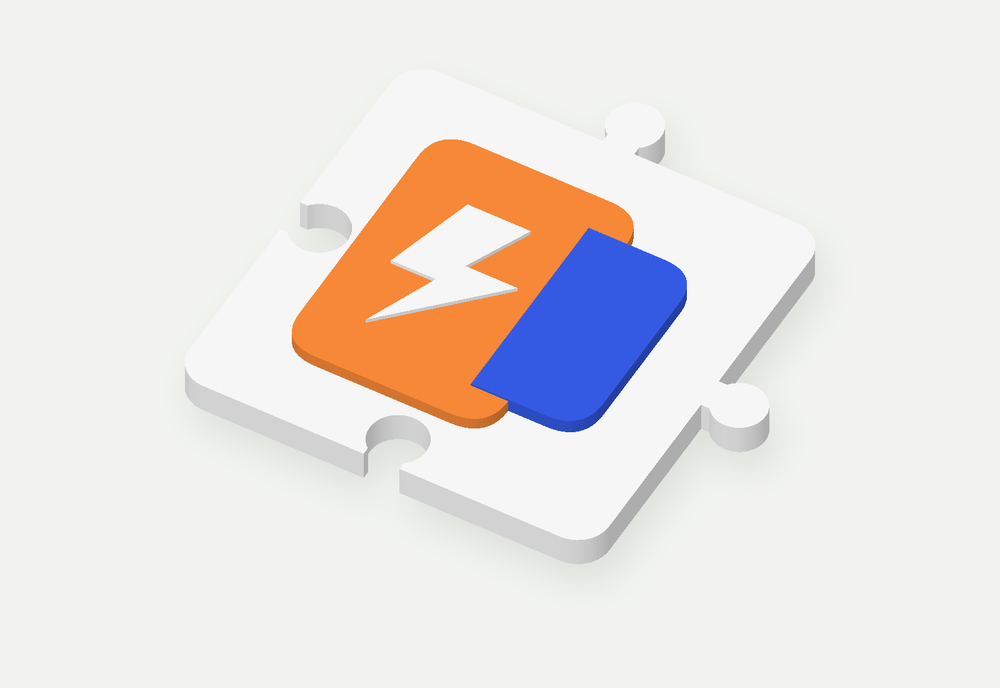
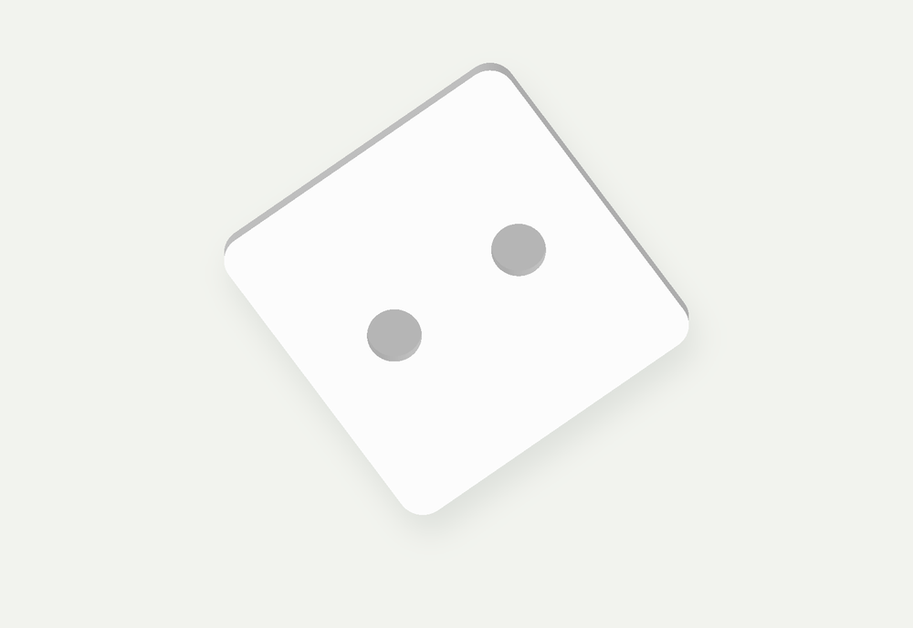

# Badge Generator

[Open the app](https://yinbaozong.github.io/badge-generator/) · [中文说明](../README.md) · [Report an issue](https://github.com/yinbaozong/badge-generator/issues)

Upload artwork, set the dimensions, and download a printable badge. SVG is the preferred format; PNG and JPG tracing is also available as an experimental feature. Files are processed in your browser and are not uploaded.

## Making your first badge

1. Use **Upload SVG**, or the separate PNG / JPG button. **Load example** gives you a starting point.
2. Choose **Single color** for a white backing and black relief, or **Multicolor** to keep solid colors. Gradients become representative solid colors.
3. Open **Dimensions**. Set the shape, width, border, backing thickness and logo thickness.
4. For magnets, open **Magnets**, enable pockets, enter the magnet size, and choose **Place magnets on back**.
5. Download from the toolbar above the preview. For color printing, open the 3MF in Bambu Studio and assign your actual filaments.

The EN / 中文 switch changes the interface language. English is the default on your first visit.

## Color modes

| Single color | Multicolor |
| --- | --- |
|  |  |
| White backing and black relief. Detached white lettering also becomes black. White paths overlapping colored artwork usually reveal the backing. | Solid color regions are preserved. Each region has a 0.2 mm height step to make painting in the slicer easier. |

STL contains geometry only. 3MF includes colors and parts, but does not assign AMS slots or printer settings.

## Shapes

**Rounded rectangle** is the default. Set width and length independently. Use a corner radius of 0 for square corners.

| Regular hexagon | Follow logo outline |
| --- | --- |
|  |  |
| Six equal sides. Length follows width automatically. Corner rounding is optional; the example uses 0. | The backing follows the artwork with a border and gently rounded edges. Width is adjustable; length follows the artwork's aspect ratio. |

**Puzzle** badges with the same dimensions can connect. The default clearance is 0.2 mm. Increase it if the fit is tight, or reduce it if loose. Width and length must both be at least 25 mm.

A logo outline can produce separate backing islands. Increase the border or choose a rectangle if you need them connected.

## Dimensions

- **Width X / Length Y** describe the backing. Length is automatic for hexagons and logo outlines.
- **Backing thickness Z** is adjustable from 1.5 to 20 mm.
- **Logo thickness Z** is the base relief thickness, adjustable from 0.2 to 20 mm. Multicolor regions add 0.2 mm steps.
- **Border** controls the backing left around the artwork.

The lower-right readout shows the finished dimensions, including total height. Changing width does not scale thickness. Invalid settings show an error above the preview. The previous valid preview may remain visible, but downloads stay disabled until the error is resolved.

## Magnet pockets

Magnets do not have to be centered. Choose **Place magnets on back**, click the backing to add up to 8 positions, then select **Done placing**. Positions are numbered and can be removed individually.

Pocket diameter includes 0.3 mm clearance; depth includes 0.1 mm. Pockets need 0.5 mm clearance from the edge and from each other. Errors identify the affected position. Thin backings may be increased automatically to keep a safe top layer.

## Reusing settings

**Export settings** and **Import settings** are at the top of the left panel. Templates save dimensions, shape, color mode and magnet positions, but not artwork files. Positions scale with the backing. Check them when applying a template to a different logo.

## PNG / JPG tracing

Best results come from clear icons with transparent or solid backgrounds. Photos are reduced to up to 6 colors. Turn off background removal if it removes light details you want to keep.

Small images and screenshots may still show rough edges when enlarged. Smoothing cannot recover missing source detail. Use an original SVG where possible, or try [PNG to SVG](https://pngtosvg.com/) and upload the result. This is an external tool; this project does not send it your files.

For SVGs, use closed filled paths. Convert text and strokes to paths first. Masks, filters and embedded images are not supported.

## Feedback and sharing

[Open an issue](https://github.com/yinbaozong/badge-generator/issues) with your artwork, settings and a screenshot if something looks wrong.

The images in this guide are renders of generated example meshes. Printed results depend on your printer, filament and slicer settings.

By [yinbaozong](https://github.com/yinbaozong). [MIT licensed](../LICENSE): use, modify and share, retain the copyright and license notice, and credit [the original project](https://github.com/yinbaozong/badge-generator). See [third-party notices](../THIRD_PARTY_NOTICES.md) for dependency licenses.
